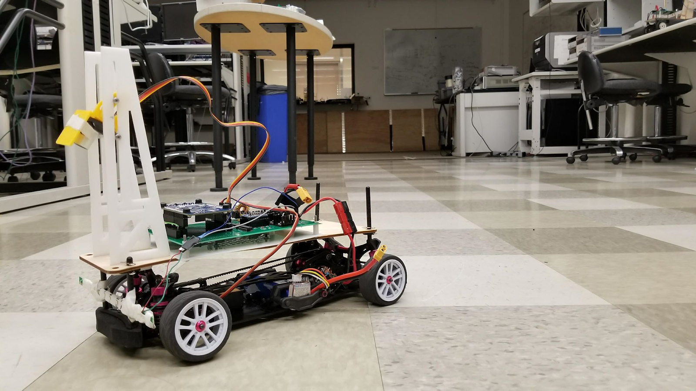
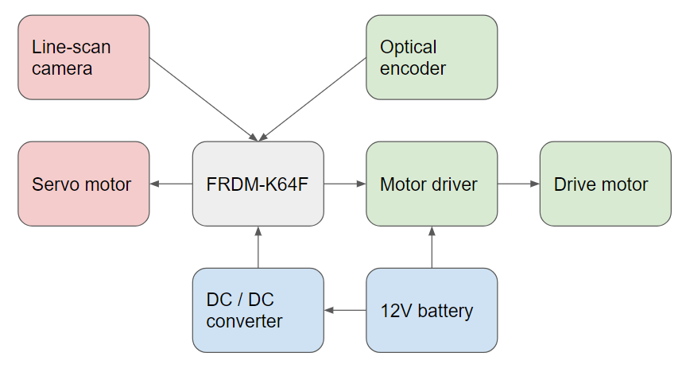
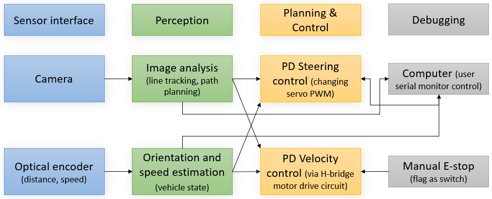

# ee192_sp18_natty

## Overview

The class project was to design a racing robot which can follow a curving and self-crossing racetrack at speeds greater than 3 meters per second using an optical sensor. Each team starts with a standard 1/10th-scale RC car platform and a pre-built CPU board, determines an optimal strategy, and designs sensors, electronics, and control algorithms. Vehicles individually follow a 100 meter course, staying on track and avoiding obstacles.

1. [Demo](https://www.youtube.com/watch?v=5AxS4pV8LCg&feature=youtu.be)
2. [Presentation](https://docs.google.com/presentation/d/1BTtjoepy1ZRDFUEocFe_17LYyh1WXvs_YgUQq_FbcSE/edit#slide=id.p)

### Hardware block diagram

### Software block diagram

